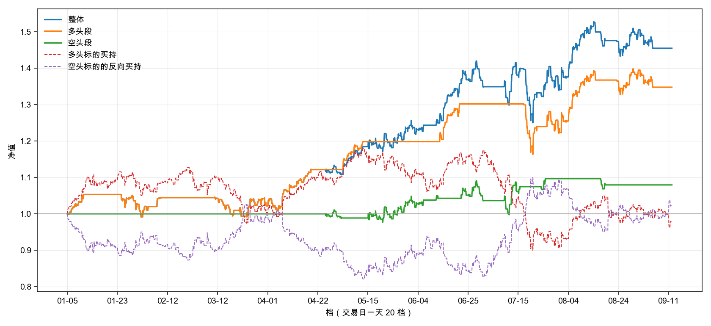

# 回测

| 项 | 值 |
|:---|:---|
| 数据截止 | 2026-09-11 |
| 回测区间 | 2026-01-01 ~ （行情末日） |
| 交易日数 | 169 |
| 池子 | 8 位 |
| 实际有数据 | 8 位 |

## 本次参数

| 键 | 值 |
|:---|:---|
| 博主池 | 云帆观市、山顶望星空的诗人、我觉醒了、故乡的云ZYH、江河之水终有入海之日、爱生活的荷叶Rp、知行合一、诸葛不亮 |
| 跑之前重跑全库 | 是 |
| 回看窗口 | 前 5 个交易日 |
| 多头标的 | 中证1000 |
| 空头标的 | 中证1000 |
| 区间 | 2026-01-01 ~ （空） |
| 开多阈值 TO_LONG | ρ > 2/3 |
| 开空阈值 TO_SHORT | ρ < 1/3 |
| 平多阈值 TX_LONG | ρ < 1/2 |
| 平空阈值 TX_SHORT | ρ > 1/2 |
| 开仓法定人数 Q_open | e > 3 |
| 平仓法定人数 Q_exit | e > 3 |

有数据的那几位：

- 云帆观市：141 条（上证、跨度 ≥ 2）
- 山顶望星空的诗人：31 条（上证、跨度 ≥ 2）
- 我觉醒了：151 条（上证、跨度 ≥ 2）
- 故乡的云ZYH：66 条（上证、跨度 ≥ 2）
- 江河之水终有入海之日：69 条（上证、跨度 ≥ 2）
- 爱生活的荷叶Rp：38 条（上证、跨度 ≥ 2）
- 知行合一：35 条（上证、跨度 ≥ 2）
- 诸葛不亮：106 条（上证、跨度 ≥ 2）

## 净值图

横轴按档 —— 交易日一天 20 个点。**非交易日那 5 档不在横轴上。**

## 指标表

| 指标 | 整体 | 多头段 | 空头段 |
|:---|:---:|:---:|:---:|
| **累计收益** | +44.88% | +34.22% | +7.94% |
| **年化收益** | +70.04% | +52.41% | +11.57% |
| **波动率** | +23.17% | +19.55% | +12.60% |
| **夏普** | 3.02 | 2.68 | 0.92 |
| **最大回撤** | +9.24% | +8.92% | +5.69% |
| **卡玛比** | 7.58 | 5.87 | 2.03 |
| **笔数** | 19 | 12 | 7 |
| **胜率** | +57.89% | +58.33% | +57.14% |
| **改仓次数** | 19 | 12 | 7 |
| **换手率** | 27.2 | 17.2 | 10.0 |

**两段的指标只看自己那一段的账**；**整体那一列把两向合起来算**。
波动率、最大回撤、夏普都按日聚合 —— 每天取收盘档（15:00）的净值算。

## 逐笔

| # | 开仓档 | 开仓价 | 平仓档 | 平仓价 | 方向 | 标的 | 收益 | 持仓档数 |
|:---:|:---|:---:|:---|:---:|:---:|:---|:---:|:---:|
| 1 | 2026-01-05 12:00 | 7719.81 | 2026-01-12 09:00 | 8129.18 | 多 | 中证1000 | +5.30% | 95 |
| 2 | 2026-01-23 15:00 | 8470.74 | 2026-02-04 18:00 | 8207.12 | 多 | 中证1000 | -3.11% | 164 |
| 3 | 2026-02-06 16:00 | 8051.57 | 2026-02-10 11:30 | 8243.56 | 多 | 中证1000 | +2.38% | 33 |
| 4 | 2026-03-11 10:30 | 8379.39 | 2026-03-19 09:00 | 8096.60 | 多 | 中证1000 | -3.37% | 118 |
| 5 | 2026-03-20 09:00 | 7909.23 | 2026-03-20 21:00 | 7783.44 | 多 | 中证1000 | -1.59% | 19 |
| 6 | 2026-03-24 09:00 | 7409.11 | 2026-04-20 10:30 | 8366.16 | 多 | 中证1000 | +12.92% | 364 |
| 7 | 2026-04-24 10:30 | 8286.34 | 2026-04-30 15:00 | 8381.95 | 空 | 中证1000 | -1.15% | 90 |
| 8 | 2026-04-30 15:00 | 8381.95 | 2026-05-13 15:00 | 8955.45 | 多 | 中证1000 | +6.84% | 121 |
| 9 | 2026-05-14 16:00 | 8778.71 | 2026-06-05 15:00 | 8340.96 | 空 | 中证1000 | +4.99% | 320 |
| 10 | 2026-06-10 15:00 | 8198.72 | 2026-06-11 16:00 | 8159.45 | 空 | 中证1000 | +0.48% | 22 |
| 11 | 2026-06-12 09:00 | 8159.45 | 2026-06-22 16:00 | 8865.68 | 多 | 中证1000 | +8.66% | 114 |
| 12 | 2026-06-22 16:00 | 8865.68 | 2026-07-01 12:00 | 8920.20 | 空 | 中证1000 | -0.62% | 134 |
| 13 | 2026-07-08 15:00 | 8117.86 | 2026-07-15 18:00 | 7817.83 | 空 | 中证1000 | +3.70% | 104 |
| 14 | 2026-07-16 14:30 | 7647.64 | 2026-07-22 12:00 | 7283.20 | 多 | 中证1000 | -4.77% | 76 |
| 15 | 2026-07-23 12:00 | 7142.04 | 2026-07-27 09:00 | 6995.69 | 空 | 中证1000 | +2.05% | 35 |
| 16 | 2026-07-27 09:00 | 6995.69 | 2026-08-07 15:00 | 7679.53 | 多 | 中证1000 | +9.78% | 193 |
| 17 | 2026-08-10 09:00 | 7679.53 | 2026-08-13 18:00 | 7715.90 | 多 | 中证1000 | +0.47% | 76 |
| 18 | 2026-08-14 15:00 | 7769.82 | 2026-08-18 12:30 | 7891.65 | 空 | 中证1000 | -1.57% | 36 |
| 19 | 2026-08-21 14:30 | 7617.09 | 2026-09-07 09:00 | 7508.09 | 多 | 中证1000 | -1.43% | 210 |

- **收益** = 标的在 `[开仓价, 平仓价]` 上按方向算的变化率，**不计成本**
- **换向那一档出两行** —— 旧的一笔在这一档收尾，新的一笔在这一档开张
- **区间末尾那一笔**按末档平掉，照常入表
- 合计 19 笔
