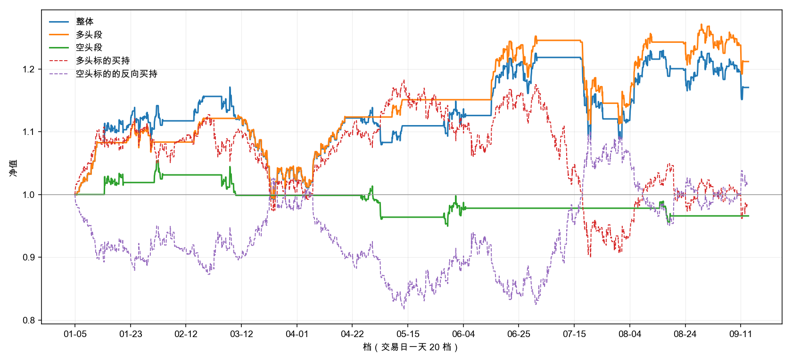

# 回测

| 项 | 值 |
|:---|:---|
| 数据截止 | 2026-09-14 |
| 回测区间 | 2026-01-01 ~ （行情末日） |
| 交易日数 | 170 |
| 池子 | 8 位 |
| 实际有数据 | 8 位 |

## 本次参数

| 键 | 值 |
|:---|:---|
| 博主池 | 云帆观市、山顶望星空的诗人、我觉醒了、故乡的云ZYH、江河之水终有入海之日、爱生活的荷叶Rp、知行合一、诸葛不亮 |
| 跑之前重跑全库 | **否** —— 只刷了行情 |
| 回看窗口 | 前 5 个交易日 |
| 多头标的 | 中证1000 |
| 空头标的 | 中证1000 |
| 区间 | 2026-01-01 ~ （空） |
| 开多阈值 TO_LONG | ρ > 2/3 |
| 开空阈值 TO_SHORT | ρ < 1/3 |
| 平多阈值 TX_LONG | ρ < 1/2 |
| 平空阈值 TX_SHORT | ρ > 1/2 |
| 开仓法定人数 Q_open | e > 3 |
| 平仓法定人数 Q_exit | e > 3 |

有数据的那几位：

- 云帆观市：147 条（上证、跨度 ≥ 2）
- 山顶望星空的诗人：31 条（上证、跨度 ≥ 2）
- 我觉醒了：136 条（上证、跨度 ≥ 2）
- 故乡的云ZYH：61 条（上证、跨度 ≥ 2）
- 江河之水终有入海之日：65 条（上证、跨度 ≥ 2）
- 爱生活的荷叶Rp：33 条（上证、跨度 ≥ 2）
- 知行合一：41 条（上证、跨度 ≥ 2）
- 诸葛不亮：115 条（上证、跨度 ≥ 2）

## 净值图

横轴按档 —— 交易日一天 20 个点。**非交易日那 5 档不在横轴上。**

## 指标表

| 指标 | 整体 | 多头段 | 空头段 |
|:---|:---:|:---:|:---:|
| **累计收益** | +16.53% | +20.64% | -3.41% |
| **年化收益** | +24.34% | +30.63% | -4.82% |
| **波动率** | +22.44% | +20.47% | +9.15% |
| **夏普** | 1.08 | 1.50 | -0.53 |
| **最大回撤** | +14.07% | +11.41% | +9.49% |
| **卡玛比** | 1.73 | 2.68 | -0.51 |
| **笔数** | 16 | 10 | 6 |
| **胜率** | +68.75% | +80.00% | +50.00% |
| **改仓次数** | 16 | 10 | 6 |
| **换手率** | 22.8 | 14.2 | 8.5 |

**两段的指标只看自己那一段的账**；**整体那一列把两向合起来算**。
波动率、最大回撤、夏普都按日聚合 —— 每天取收盘档（15:00）的净值算。

## 逐笔

| # | 开仓档 | 开仓价 | 平仓档 | 平仓价 | 方向 | 标的 | 收益 | 持仓档数 |
|:---:|:---|:---:|:---|:---:|:---:|:---|:---:|:---:|
| 1 | 2026-01-05 12:00 | 7719.81 | 2026-01-13 09:00 | 8357.01 | 多 | 中证1000 | +8.25% | 115 |
| 2 | 2026-01-14 12:00 | 8410.43 | 2026-01-21 12:00 | 8250.03 | 空 | 中证1000 | +1.91% | 101 |
| 3 | 2026-01-21 15:00 | 8247.68 | 2026-01-30 21:00 | 8254.86 | 多 | 中证1000 | +0.09% | 147 |
| 4 | 2026-01-30 21:00 | 8254.86 | 2026-02-04 10:30 | 8156.60 | 空 | 中证1000 | +1.19% | 46 |
| 5 | 2026-02-24 09:00 | 8204.83 | 2026-02-27 09:00 | 8490.62 | 多 | 中证1000 | +3.48% | 61 |
| 6 | 2026-03-04 15:00 | 8094.52 | 2026-03-10 16:00 | 8350.09 | 空 | 中证1000 | -3.16% | 82 |
| 7 | 2026-03-10 16:00 | 8350.09 | 2026-04-20 10:30 | 8366.32 | 多 | 中证1000 | +0.19% | 551 |
| 8 | 2026-04-24 10:30 | 8286.37 | 2026-05-06 17:00 | 8574.56 | 空 | 中证1000 | -3.48% | 112 |
| 9 | 2026-05-08 15:00 | 8741.15 | 2026-05-13 15:00 | 8955.45 | 多 | 中证1000 | +2.45% | 61 |
| 10 | 2026-05-27 15:00 | 8546.51 | 2026-06-04 15:00 | 8420.09 | 空 | 中证1000 | +1.48% | 121 |
| 11 | 2026-06-12 15:00 | 8202.80 | 2026-07-01 17:00 | 8876.63 | 多 | 中证1000 | +8.21% | 243 |
| 12 | 2026-07-16 14:30 | 7648.71 | 2026-07-24 12:00 | 7033.98 | 多 | 中证1000 | -8.04% | 116 |
| 13 | 2026-07-29 17:00 | 7095.19 | 2026-08-07 15:00 | 7679.53 | 多 | 中证1000 | +8.24% | 139 |
| 14 | 2026-08-10 09:00 | 7679.53 | 2026-08-12 09:00 | 7698.05 | 多 | 中证1000 | +0.24% | 41 |
| 15 | 2026-08-13 14:30 | 7794.08 | 2026-08-18 12:30 | 7891.65 | 空 | 中证1000 | -1.25% | 57 |
| 16 | 2026-08-21 14:30 | 7616.90 | 2026-09-14 09:00 | 7427.24 | 多 | 中证1000 | -2.49% | 310 |

- **收益** = 标的在 `[开仓价, 平仓价]` 上按方向算的变化率，**不计成本**
- **换向那一档出两行** —— 旧的一笔在这一档收尾，新的一笔在这一档开张
- **区间末尾那一笔**按末档平掉，照常入表
- 合计 16 笔
