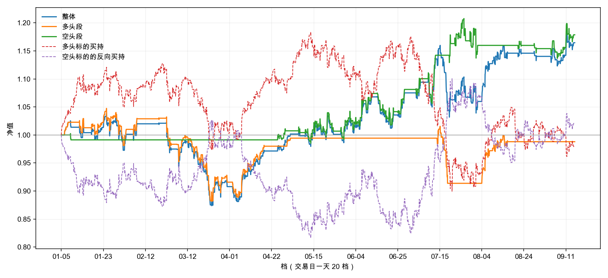

# 回测

| 项 | 值 |
|:---|:---|
| 数据截止 | 2026-09-15 |
| 回测区间 | 2026-01-01 ~ （行情末日） |
| 交易日数 | 171 |
| 池子 | 8 位 |
| 实际有数据 | 8 位 |

## 本次参数

| 键 | 值 |
|:---|:---|
| 博主池 | 云帆观市、山顶望星空的诗人、我觉醒了、故乡的云ZYH、江河之水终有入海之日、爱生活的荷叶Rp、知行合一、诸葛不亮 |
| 跑之前重跑全库 | 是 |
| 回看窗口 | 前 5 个交易日 |
| 档表 | 交易日 20 档 |
| 两档边界 | 交易日跨度 ≥ 2 归波段 |
| 多头标的 | 中证1000 |
| 空头标的 | 中证1000 |
| 区间 | 2026-01-01 ~ （空） |
| 开多阈值 TO_LONG | ρ > 2/3 |
| 开空阈值 TO_SHORT | ρ < 1/3 |
| 平多阈值 TX_LONG | ρ < 1/2 |
| 平空阈值 TX_SHORT | ρ > 1/2 |
| 开仓法定人数 Q_open | e > 3 |
| 平仓法定人数 Q_exit | e > 3 |

有数据的那几位：

- 云帆观市：346 条（上证、跨度 ≥ 2）
- 山顶望星空的诗人：68 条（上证、跨度 ≥ 2）
- 我觉醒了：155 条（上证、跨度 ≥ 2）
- 故乡的云ZYH：296 条（上证、跨度 ≥ 2）
- 江河之水终有入海之日：178 条（上证、跨度 ≥ 2）
- 爱生活的荷叶Rp：60 条（上证、跨度 ≥ 2）
- 知行合一：58 条（上证、跨度 ≥ 2）
- 诸葛不亮：264 条（上证、跨度 ≥ 2）

## 净值图

横轴按档 —— 交易日一天 20 个点。**非交易日那 5 档不在横轴上。**

## 指标表

| 指标 | 整体 | 多头段 | 空头段 |
|:---|:---:|:---:|:---:|
| **累计收益** | +16.46% | -1.20% | +17.87% |
| **年化收益** | +24.06% | -1.69% | +26.20% |
| **波动率** | +23.21% | +17.68% | +15.04% |
| **夏普** | 1.04 | -0.10 | 1.74 |
| **最大回撤** | +15.29% | +15.29% | +5.22% |
| **卡玛比** | 1.57 | -0.11 | 5.01 |
| **笔数** | 29 | 13 | 16 |
| **胜率** | +58.62% | +53.85% | +62.50% |
| **改仓次数** | 29 | 13 | 16 |
| **换手率** | 41.0 | 18.4 | 22.6 |

**两段的指标只看自己那一段的账**；**整体那一列把两向合起来算**。
波动率、最大回撤、夏普都按日聚合 —— 每天取收盘档（15:00）的净值算。

## 逐笔

| # | 开仓档 | 开仓价 | 平仓档 | 平仓价 | 方向 | 标的 | 收益 | 持仓档数 |
|:---:|:---|:---:|:---|:---:|:---:|:---|:---:|:---:|
| 1 | 2026-01-06 09:00 | 7753.88 | 2026-01-07 12:00 | 7930.24 | 多 | 中证1000 | +2.27% | 27 |
| 2 | 2026-01-07 16:00 | 7906.42 | 2026-01-08 12:00 | 7975.31 | 空 | 中证1000 | -0.87% | 14 |
| 3 | 2026-01-12 22:00 | 8357.01 | 2026-01-14 13:30 | 8276.90 | 多 | 中证1000 | -0.96% | 31 |
| 4 | 2026-01-16 16:00 | 8232.73 | 2026-02-03 16:00 | 8209.10 | 多 | 中证1000 | -0.29% | 241 |
| 5 | 2026-02-05 16:00 | 8068.08 | 2026-02-09 12:00 | 8218.79 | 多 | 中证1000 | +1.87% | 34 |
| 6 | 2026-02-26 12:30 | 8482.29 | 2026-02-26 17:00 | 8490.62 | 多 | 中证1000 | +0.10% | 8 |
| 7 | 2026-03-02 16:00 | 8476.97 | 2026-03-05 09:00 | 8094.52 | 多 | 中证1000 | -4.51% | 48 |
| 8 | 2026-03-06 14:00 | 8253.05 | 2026-03-30 09:00 | 7746.31 | 多 | 中证1000 | -6.14% | 311 |
| 9 | 2026-03-30 13:30 | 7741.97 | 2026-03-31 11:00 | 7681.71 | 多 | 中证1000 | -0.78% | 16 |
| 10 | 2026-04-01 15:00 | 7764.15 | 2026-04-20 09:00 | 8307.44 | 多 | 中证1000 | +7.00% | 229 |
| 11 | 2026-04-23 19:00 | 8362.74 | 2026-04-28 18:00 | 8226.69 | 空 | 中证1000 | +1.63% | 60 |
| 12 | 2026-04-29 10:00 | 8256.96 | 2026-04-30 12:00 | 8377.91 | 多 | 中证1000 | +1.46% | 25 |
| 13 | 2026-05-07 16:00 | 8714.51 | 2026-05-08 13:30 | 8741.87 | 空 | 中证1000 | -0.31% | 17 |
| 14 | 2026-05-12 10:30 | 8822.03 | 2026-05-25 16:00 | 8799.31 | 空 | 中证1000 | +0.26% | 191 |
| 15 | 2026-05-28 09:00 | 8546.51 | 2026-06-08 15:00 | 8081.26 | 空 | 中证1000 | +5.44% | 153 |
| 16 | 2026-06-09 12:00 | 8193.07 | 2026-06-11 12:00 | 8097.40 | 空 | 中证1000 | +1.17% | 41 |
| 17 | 2026-06-15 10:30 | 8425.47 | 2026-06-24 09:00 | 8680.04 | 空 | 中证1000 | -3.02% | 118 |
| 18 | 2026-06-24 19:00 | 8793.49 | 2026-06-29 12:00 | 8458.74 | 空 | 中证1000 | +3.81% | 51 |
| 19 | 2026-07-03 09:00 | 8625.33 | 2026-07-07 09:00 | 8472.60 | 空 | 中证1000 | +1.77% | 41 |
| 20 | 2026-07-09 10:30 | 8095.66 | 2026-07-14 09:00 | 7787.85 | 空 | 中证1000 | +3.80% | 58 |
| 21 | 2026-07-14 09:30 | 7799.81 | 2026-07-17 18:00 | 7168.00 | 多 | 中证1000 | -8.10% | 75 |
| 22 | 2026-07-20 10:30 | 7094.60 | 2026-07-21 09:00 | 6965.38 | 空 | 中证1000 | +1.82% | 18 |
| 23 | 2026-07-21 17:00 | 7259.86 | 2026-07-27 17:00 | 7228.78 | 空 | 中证1000 | +0.43% | 81 |
| 24 | 2026-07-28 16:00 | 7026.28 | 2026-08-03 09:00 | 7075.51 | 空 | 中证1000 | -0.70% | 68 |
| 25 | 2026-08-03 16:00 | 7079.78 | 2026-08-06 22:00 | 7530.43 | 多 | 中证1000 | +6.37% | 67 |
| 26 | 2026-08-07 14:30 | 7643.50 | 2026-08-17 09:00 | 7769.82 | 多 | 中证1000 | +1.65% | 110 |
| 27 | 2026-08-20 09:30 | 7602.50 | 2026-08-21 10:30 | 7602.79 | 空 | 中证1000 | -0.00% | 23 |
| 28 | 2026-08-27 12:00 | 7702.85 | 2026-08-28 12:00 | 7740.98 | 空 | 中证1000 | -0.49% | 21 |
| 29 | 2026-09-03 17:00 | 7600.10 | 2026-09-15 22:00 | 7437.70 | 空 | 中证1000 | +2.14% | 166 |

- **收益** = 标的在 `[开仓价, 平仓价]` 上按方向算的变化率，**不计成本**
- **换向那一档出两行** —— 旧的一笔在这一档收尾，新的一笔在这一档开张
- **区间末尾那一笔**按末档平掉，照常入表
- 合计 29 笔
